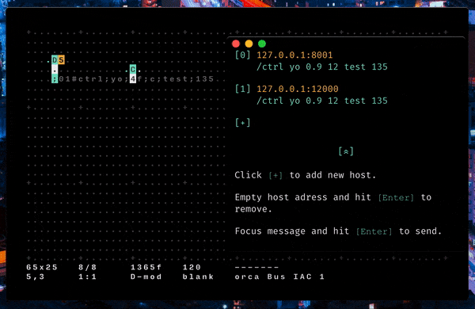

# Λioi
Electron app using [ORCΛ](https://wiki.xxiivv.com/#orca)'s UDP operator to send complex OSC message to multiple hosts.



### Install & Run
You can find [builds](https://github.com/MAKIO135/aioi/releases) for **OSX, Windows and Linux**, or if you wish to build it yourself, follow these steps:
```
git clone https://github.com/MAKIO135/aioi.git
cd aioi/desktop
npm install
npm run start
```

### Usage
- path:  
    `;foo` would send `/foo` to the first host in Λioi  
    `;bar` would send `/bar` to the first host in Λioi

- integers:  
    `;foo;5` would send `/foo 5` to the first host in Λioi  
    `;foo;127` would send `/foo 127` to the first host in Λioi

- strings:  
    `;foo;yes` would send `/foo "yes"` to the first host in Λioi  
    `;foo;h3ll0` would send `/foo "h3ll0"` to the first host in Λioi

- floats:  
    `;foo;3f` would send `/foo 0.3` to the first host in Λioi  
    `;foo;235f` would send `/foo 23.5` to the first host in Λioi

- base 36 integers:  
    `;foo;c` would send `/foo 12` to the first host in Λioi

- multiple parameters:  
    split parameters using `;`  
    `;foo;yo;5` would send `/foo "yo" 5` to the first host in Λioi

- choice of host:  
    when no index is mentionned Λioi sends the message to the first host  
    start UDP message with `base 36 indexes` followed by `#`  
    `;2#foo` would send `/foo` to the third host in Λioi  
    `;a#foo;2f` would send `/foo 0.2` to the tenth host in Λioi

- send to multiple hosts:  
    `;2a#foo` would send `/foo` to the third and tenth hosts in Λioi

### Extra
This application supports the [Ecosystem Theme](https://github.com/hundredrabbits/Themes).  
Extra thanks to [Devine Lu Linvega](https://wiki.xxiivv.com/#devine+lu+linvega) for all his works.
