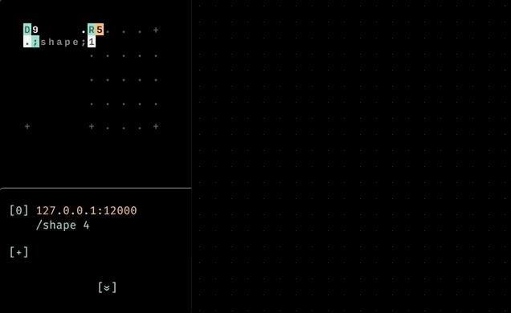
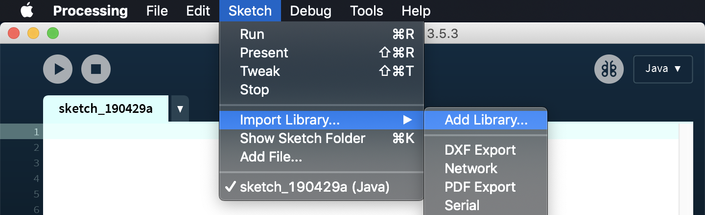
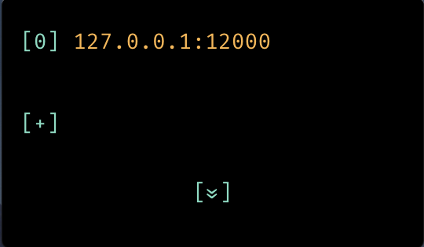

# ORCΛ x Λioi x Processing



## Dependency
To get Processing (*P5*) working with OSC, we need the [oscP5 library](http://www.sojamo.de/libraries/oscP5/).

It can be added through P5's menu:  
`Sketch -> Import Library -> Add Library: oscP5`


## Config

**ORCΛ**:  
Make sure that ORCΛ is running UDP on port 49161 (Default)


```orca
D9......R4
.;shape;0.
```

**Λioi**:  
Set first host to `127.0.0.1:12000`  


**Processing**:
```java
import oscP5.*;

OscP5 oscP5;

float c = 255;
void setup() {
  size(400, 400);
  background(0);
  oscP5 = new OscP5(this, 12000);
}

void draw() {
  background(c);
  c = lerp(c, 0, 0.1);
}

void oscEvent(OscMessage msg) {
  print("### received an osc message.");
  print(" addrpattern: " + msg.addrPattern());
  println(" typetag: " + msg.typetag());
  c = 255;
}
```