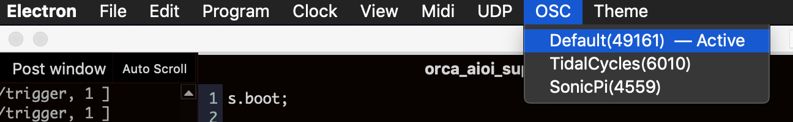

# ORCΛ x Λioi x SuperCollider


## Config

**ORCΛ**:  
Make sure that ORCΛ is running UDP on port 49161 (Default)


```orca
.D.........R4
..;trigger;1.
```


**Λioi**:  
Set first host to `127.0.0.1:57120`  


**SuperCollider**:
```SuperCollider
s.boot;

// Add SynthDef

(
SynthDef(\trigger_synth, {| note = 0 |
	var src, freq;
	freq = (note + 60).midicps;
	src = SinOsc.ar(freq, 0, 0.3) * EnvGen.ar(Env.perc(), doneAction:2);
	Out.ar(0, src);
}).add;
)

// define OSCdef to receive osc at /trigger

(
OSCdef(\orca_trigger, {| msg |
	var note;
	msg.postln;
	note = msg;
	s.sendMsg(9, \trigger_synth, s.nextNodeID, 0, 1, \note, msg[1]);
}, 'trigger');
)

```