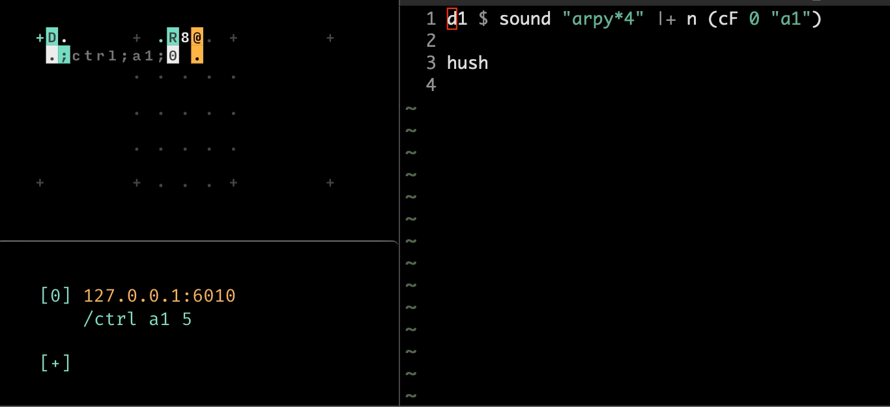
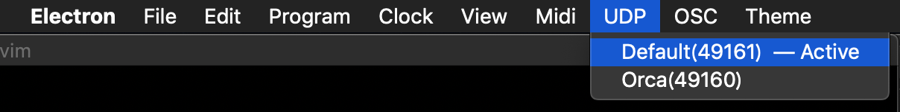
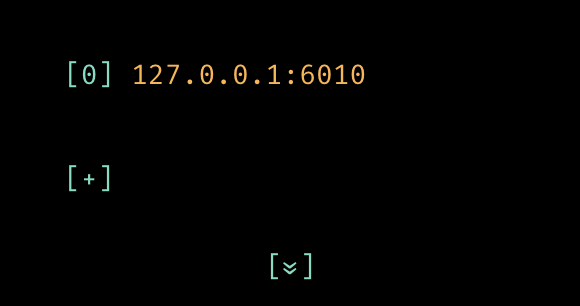

# ORCΛ x Λioi x TidalCycles



TidalCycles has `cF` function which controls value from OSC message.

## Config

**ORCΛ**:  
Make sure that ORCΛ is running UDP on port 49161 (Default)


```orca
.D.........R8
..;ctrl;a1;1.
```

**Λioi**:  
Set first host to `127.0.0.1:6010` where TidalCycles listening.


**TidalCycles**:

```haskell
d1 $ sound "arpy*4" |+ n (cF 0 "a1")
```

First parameter of `cF` function is default value.

Second parameter is name for to access the value whitch we set at Orca's OSC message.

In our case, `a1` in Orca's message is match with Tidal's second parameter of `cF` function.

see [reference](https://tidalcycles.org/index.php/Controller_Input)
