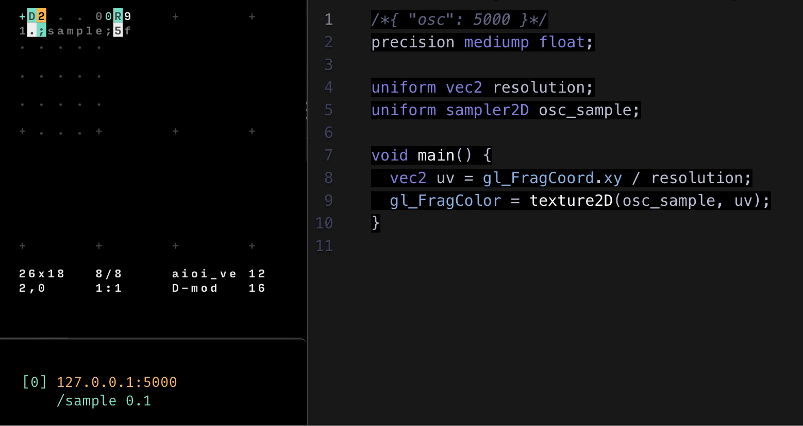
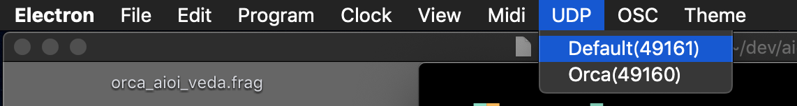
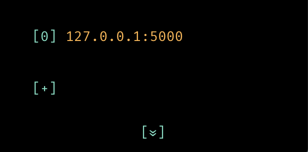

# ORCΛ x Λioi x Veda



## Config

**ORCΛ**:  
Make sure that ORCΛ is running UDP on port 49161 (Default)


```orca
.D8......0R9
..;sample;7f
```

Value should be float value. You need to add `f` character after send value.

**Λioi**:  
Set first host to `127.0.0.1:5000`

Veda can set any port for listening by the way which describe in the next chapter. Temporally we set 5000 to it.



**Veda**:
```glsl
/*{ "osc": 5000 }*/

uniform vec2 resolution;
uniform sampler2D osc_sample;

void main() {
  vec2 uv = gl_FragCoord.xy / resolution;
  gl_FragColor = texture2D(osc_sample, uv));
}
```

`/*{ "osc": 5000 }*/`

Top of shader file, OSC listening port is set by one line code which is be comment out.

`uniform sampler2D osc_sample;`

Veda receives OSC message as texture data. We have to access it from sampler2D type variable.

Variable name of sampler2D has rule that generate OSC address structure automativaly.

After word `osc`, each `_` underbar separate address tree structure.

e.g. 

`/foo` -> `sampler2D osc_foo`

`/foo/bar` -> `sampler2D osc_foo_bar`

In our case, address should be `/sample`.

`gl_FragColor = texture2D(osc_sample, uv));`

Finally we can access value with `texture2D` function.

see [reference](https://veda.gl/features/osc/)
